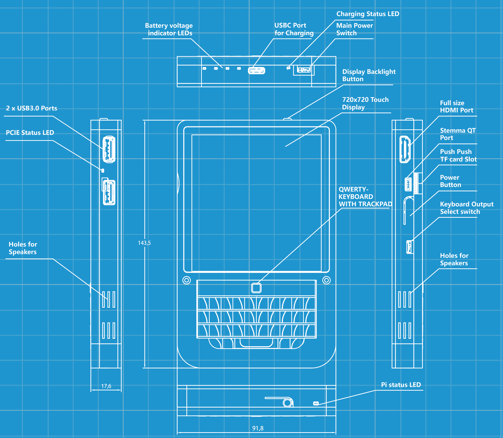

 

 <h3 align="center">The HackberryPi_CM5 project repository</h3>

---

The HackberryPi_CM5 project is a RaspberryPi Compute Module SBC(single board computer) powered handheld computer with reuse of original keyboard from old Blackberry phones. The goal of the project is to create a portable linux-powered computer that lets the user gain a deeper understanding of Linux and explore the architecture of hardware, software, and the Linux kernel. This repository will be used to share information about the project and tutorial about how to make use of this device.

**Designer's bio**: Zitao, currently a master’s student in Mechanical Engineering and Industrial Design at the Technical University of Dresden, Germany  

 
[Questions or need more info? Join my Discord Channel!](https://discord.gg/WzPthAmMbP)
 
 

  # <a name='Dimension and weight  '>Dimension and weight</a>
  **Overall dimensions:** 143.5x91.8x17.6mm  
  **Weight:** 306 Gramm(with battery,cm5 and heat sink)  
  Upper and lower case made of aluminium  
  Middle part 3d printed  
  

 

 And this is how it looks like inside the device:
  

 

 
 # <a name='About this Device '>About this Device </a>

| **Feature**                    | **Details**                                                                                                                                          |
|-------------------------------|------------------------------------------------------------------------------------------------------------------------------------------------------|
| **SBC**                       | Only compatible with Raspberry Pi CM5. [CM5 Datasheet](https://datasheets.raspberrypi.com/cm5/cm5-datasheet.pdf)                                     |
| **CPU**                       | BCM2712, quad-core Cortex-A76 (ARMv8) 64-bit SoC @ 2.4GHz                                                                                             |
| **Dual Speakers**            | Dual speakers connected via Bluetooth. [More information](https://github.com/ZitaoTech/HackberryPiCM5/tree/main/Speakers)                                 |
| **2242 NVME Slot**           | Supports 2242 SSD or Halio AI accelerator card. [More information](https://github.com/ZitaoTech/HackberryPiCM5/tree/main/NVME%20Slot)                  |
| **RTC Battery**              | CR927 battery slot for RTC functionality. [More information](https://github.com/ZitaoTech/HackberryPiCM5/tree/main/RTC-Battery)                        |
| **Metal Body**               | Aluminium front and back plate; 3D-printed middle section                                                                                              |
| **Display**                  | 4" 720x720 high-resolution TFT with multi-touch                                                                                                       |
| **USB Ports**                | 2x USB 3.0 ports                                                                                                                                       |
| **HDMI Port**                | One full-sized HDMI port                                                                                                                              |
| **Battery Type**             | 5000mAh LiPo battery. [More information](https://github.com/ZitaoTech/HackberryPiCM5/tree/main/Battery)                                               |
| **Battery Life**             | ~5 hours idle, 3–4 hours typical usage                                                                                                                 |
| **Battery Voltage Measurement** | I2C-based battery voltage measurement. [More information](https://github.com/ZitaoTech/HackberryPiCM5/tree/main/Battery_Voltage_Measure)          |
| **Magnet on Back Plate**     | Built-in magnet compatible with iPhone-style wired MagSafe power banks. [More information](https://github.com/ZitaoTech/HackberryPiCM5/tree/main/Magnet%20backplate) |
| **Keyboard Mouse Combo**     | On-board combo; supports BlackBerry Q10, Q20, or 9900 keyboard                                                                                        |
| **Custom Keymap**            | Configurable via [VIAL](https://get.vial.today/). [More information](https://github.com/ZitaoTech/HackberryPiCM5)                                      |
| **Charging Rate**            | 1.5A–2A via Type-C; full charge in 2–3 hours                                                                                                           |
| **Stemma I2C Port**          | On-board Stemma I2C port for external sensors                                                                                                         |

# <a name='3D model  '>3D model</a>
In this page you can find the 3D model of each part of this device, you can print or modify the part yourself.
* [3D model about this device](https://github.com/ZitaoTech/HackberryPiCM5/tree/main/3D-Modell)
  
# <a name='Assembly Guidelines  '>Assembly Guidelines</a>
The HackberryPi_CM5 comes without the CM5 unit. Generally, you only need to install the CM5 and the passive heatsink on top. For details, please refer to this page.
* [Assembly Guidelines](https://github.com/ZitaoTech/HackberryPiCM5/tree/main/Assembly)  

# <a name='Hardware  '>Hardware</a>
This page offers an in-depth hardware overview of the HackberryPi_CM5, designed to guide anyone interested in creating an adapter board for the CM5 module, exploring the keyboard’s hardware architecture, and related concepts. For more details, please visit this page.
* [Hardware](https://github.com/ZitaoTech/HackberryPiCM5/tree/main/Hardware)  

# <a name='Speakers  '>Speakers</a>
There are dual speakers on board, it is needed to pair with the bluetooth audio module to make sound for more information please refer to this page.  
* [Pair with speakers](https://github.com/ZitaoTech/HackberryPiCM5/tree/main/Speakers#pair-with-the-speakers)

# <a name='External antenna  '>External antenna</a>
Because of the metall case and the mounted heat sink, the performance of the original PCB antenna might be a little bit disappointing. This page can tell you how to assemble an external antenna;
* [External antenna](https://github.com/ZitaoTech/HackberryPiCM5/tree/main/External%20Antenna)

# <a name='Gallery  '>Gallery</a>
For more photos of the HackberryPi_CM5, please refer to this page.
* [Gallery](https://github.com/ZitaoTech/HackberryPiCM5/tree/main/Gallery)

# <a name='Where to buy from U.S.A Assembled'>Where to buy</a>
* [Buy from Carbon Computers](https://carboncomputers.us/)

# <a name='Where to buy from China '>Where to buy</a>
* [Buy from elecrow](https://www.elecrow.com/catalogsearch/result/?q=HackberryPi_CM5)

# <a name='Short video  '>Short video</a>
* [Tiktok: Mr.Hackberry(One friend of mine)](https://www.tiktok.com/@mr.hackberry_pi)
