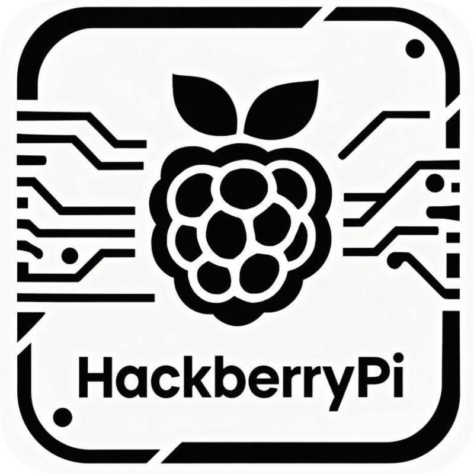

<p align="center">

 </p>

 <h3 align="center">The HackberryPi_CM5 project repository</h3>

<div align="center">

[]()
[](https://github.com/ZitaoTech/HackberryPiCM5/issues)
[](https://github.com/ZitaoTech/HackberryPiCM5/pulls)
[](/LICENSE)

</div>

---

The HackberryPi_CM5 project is a RaspberryPi Compute Module SBC(single board computer) powered handheld computer with reuse of original keyboard from old Blackberry phones. The goal of the project is to create a portable linux-powered computer that lets the user gain a deeper understanding of Linux and explore the architecture of hardware, software, and the Linux kernel. This repository will be used to share information about the project and tutorial about how to make use of this device.

<p align="center">

</p>

**Designer's bio**: Zitao, currently a master’s student in Mechanical Engineering and Industrial Design at the Technical University of Dresden, Germany  

<div align="center">
 
[Questions or need more info? Join my Discord Channel!](https://discord.gg/WzPthAmMbP)
 
 </div>

  # <a name='Dimension and weight  '>Dimension and weight</a>
  **Overall dimensions:** 143.5x91.8x17.6  
  **Weight:** 306 Gramm  
  Upper and lower case made of aluminium  
  Middle part 3d printed  
  <p align="center">

 </p>
 And this is how it looks like inside the device:

 
 # <a name='About this Device '>About this Device </a>
 
 ### Main Features:  
 **SBC**: ```Only``` compatible with RaspberryPi CM5. [CM5](https://datasheets.raspberrypi.com/cm5/cm5-datasheet.pdf) is powered by BCM2712, quad core Cortex-A76 (ARMv8) 64-bit SoC @ 2.4GHz.  
 **Dual Speakers**: There are two speakers on board, you can connect them via ```Bluetooth```. [More information.](https://github.com/ZitaoTech/HackberryPiCM5/tree/main/Speakers)  
 **2242 NVME Slot**: You can connect a ```2242 SSD``` with the device on board or ```Halio AI accelerator card.``` [More information.](https://github.com/ZitaoTech/HackberryPiCM5/tree/main/NVME%20Slot)  
 **RTC battery**: There is a ```CR927``` battery slot on board, you can use the RTC function on cm5 very easily. [More information](https://github.com/ZitaoTech/HackberryPiCM5/tree/main/RTC-Battery)  
 **Metall body**: The front and back plate is made of ```Aluminium```, the middle part is 3D-printed.  
 **Display**: 4" ```720X720``` high resolution TFT display with multi-touch function.  
 **USB Ports**: 2x```USB3.0``` Speed Ports.  
 **Full sized HDMI Port**: There is ```one full sized``` HDMI port on board.  
 **Battery Type**: ```5000mah``` Lipo Battery. [More Information](https://github.com/ZitaoTech/HackberryPiCM5/tree/main/Battery)  
 **Battery Life**: Approximately ```5 hours idle time```, about 3-4 hours depending on the task when normally used.  
 **Battery Voltage Measurement**: There is a chip on boared to measure the ```battery voltage``` through I2C interface. [More information](https://github.com/ZitaoTech/HackberryPiCM5/tree/main/Battery_Voltage_Measure)   
 **Magnet at the back plate**: There is ```magnet``` which is the same as those on iphone to make the device compaticable with wired magsafe power bank. [More information](https://github.com/ZitaoTech/HackberryPiCM5/tree/main/Magnet%20backplate )  
 **Keyboard Mouse Combo**: Yes, this cyberdeck has ```keyboard and mouse combo``` on board. You can choose blackberry Q10 or Q20 or 9900 keyboard.  
 **Fully customizable keymap**: You can connect the keyboard with a computer and ```customizable``` the keymap through [VIAL](https://get.vial.today/) easily. More Information.  
 **Charging Ampere**: Charge through the Type-C port. ```1.5A-2A charging rate```; this handheld can be fully charged within 2-3 hours.  
 **Stemma I2C Port**: This device has a ```Stemma I2C port``` on board, you can connect with any I2C sensors.  


# <a name='3D model  '>3D model</a>
In this page you can find the 3D model of each part of this device, you can print or modify the part yourself.
* [3D model about this device](https://github.com/ZitaoTech/HackberryPiCM5/tree/main/3D-Modell)
  
# <a name='Assembly Guidelines  '>Assembly Guidelines</a>
The HackberryPi_CM5 comes without the CM5 unit. Generally, you only need to install the CM5 and the passive heatsink on top. For details, please refer to this page.
* [Assembly Guidelines](https://github.com/ZitaoTech/HackberryPiCM5/tree/main/Assembly)  

# <a name='Hardware  '>Hardware</a>
This page offers an in-depth hardware overview of the HackberryPi_CM5, designed to guide anyone interested in creating an adapter board for the CM5 module, exploring the keyboard’s hardware architecture, and related concepts. For more details, please visit this page.
* [Hardware](https://github.com/ZitaoTech/HackberryPiCM5/tree/main/Hardware)  

# <a name='Speakers  '>Speakers</a>
There are dual speakers on board, it is needed to pair with the bluetooth audio module to make sound for more information please refer to this page.  
* [Pair with speakers](https://github.com/ZitaoTech/HackberryPiCM5/tree/main/Speakers#pair-with-the-speakers)
